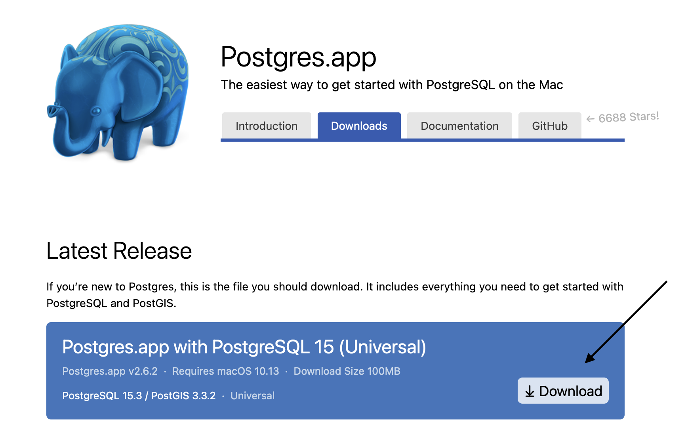

<a id="readme-top"></a>

<!--
HOW TO USE:
This is an example of how you may give instructions on setting up your project locally.

Modify this file to match your project and remove sections that don't apply.

REQUIRED SECTIONS:
- Table of Contents
- About the Project
  - Built With
  - Live Demo
- Getting Started
- Authors
- Future Features
- Contributing
- Show your support
- Acknowledgements
- License

After you're finished please remove all the comments and instructions!
-->


<!-- TABLE OF CONTENTS -->

# 📗 Table of Contents

- [📖 About the Project](#about-project)
  - [🛠 Built With](#built-with)
    - [Tech Stack](#tech-stack)
    - [Key Features](#key-features)
  <!-- - [🚀 Live Demo](#live-demo) -->
- [💻 Getting Started](#getting-started)
  - [Setup](#setup)
  - [Prerequisites](#prerequisites)
  - [Install](#install)
  - [Usage](#usage)
  - [Run tests](#run-tests)
  - [Deployment](#triangular_flag_on_post-deployment)
- [👥 Authors](#authors)
- [🔭 Future Features](#future-features)
- [🤝 Contributing](#contributing)
- [⭐️ Show your support](#support)
- [🙏 Acknowledgements](#acknowledgements)
- [❓ FAQ](#faq)
- [📝 License](#license)

<!-- PROJECT DESCRIPTION -->

# 📖 About The Project <a id="about-project"></a>

**Vet Clinic DB** is a database that creates a table named __animals__ and inserts 4 animals with their descriptions including name, date_of_birth, weight_kg, neutered, escape_attempts and then makes different queries on those animals. It is meant for SQL learning purpose.

## 🛠 Built With <a id="built-with"></a>

### Tech Stack <a id="tech-stack"></a>

<details>
  <summary>Client</summary>
  <ul>
    <li><a href="https://www.postgresql.org/docs/current/app-psql.html">psql</a></li>
  </ul>
</details>

<details>
<summary>Database</summary>
  <ul>
    <li><a href="https://www.postgresql.org/">PostgreSQL</a></li>
  </ul>
</details>

<p align="right">(<a href="#readme-top">back to top</a>)</p>

<!-- Features -->

### Key Features <a id="key-features"></a>

- **Transactions are Atomic**
- **It is Consistent**
- **It's Reliable/Durable**
- **It is PostgreSQL**

<p align="right">(<a href="#readme-top">back to top</a>)</p>

<!-- LIVE DEMO -->

<!-- ## 🚀 Live Demo <a id="live-demo"></a>

> Add a link to your deployed project.

- [Live Demo Link](<replace-with-your-deployment-URL>)

<p align="right">(<a href="#readme-top">back to top</a>)</p> -->

<!-- GETTING STARTED -->

## 💻 Getting Started <a id="getting-started"></a>

How to install PostgreSQL on MacOS you ask?
Well, let's start by install this simple app: [PostgreSQL.app](https://postgresapp.com/downloads.html)



Then follow the instructions (1-2-3) in [here](https://postgresapp.com/)

And then if you have an open terminal close and open a new one.
Enter the command below:
 ```sh
  $ psql
  ```
Use all the default fields by pressing enter and you'll be logged in.

<br />
<!-- 
### Prerequisites
In order to run this project you need: [Postgres](https://postgresapp.com/) SQL 
-->

<!--
Example command:

```sh
 gem install rails
```
 -->

<p align="right">(<a href="#readme-top">back to top</a>)</p>

### Setup

Clone this repository to your desired folder:

Example commands:

```sh
  cd my-folder
  git clone https://github.com/dev89s/vet-clinic-db.git
```
<!-- 
### Install

Install this project with: -->

<!--
Example command:

```sh
  cd my-project
  gem install
```
--->

<!-- ### Usage

To run the project, execute the following command: -->

<!--
Example command:

```sh
  rails server
```
--->
<!-- 
### Run tests

To run tests, run the following command: -->

<!--
Example command:

```sh
  bin/rails test test/models/article_test.rb
```
--->

<!-- ### Deployment

You can deploy this project using: -->

<!--
Example:

```sh

```
 -->

<!-- <p align="right">(<a href="#readme-top">back to top</a>)</p> -->

<!-- AUTHORS -->

## 👥 Authors <a id="authors"></a>

👤 **Author1**

- GitHub: [@dev89s](https://github.com/dev89s)
- LinkedIn: [LinkedIn](https://linkedin.com/in/sasan-moshirabadi)

<!-- 👤 **Author2**

- GitHub: [@githubhandle](https://github.com/githubhandle)
- Twitter: [@twitterhandle](https://twitter.com/twitterhandle)
- LinkedIn: [LinkedIn](https://linkedin.com/in/linkedinhandle) -->

<p align="right">(<a href="#readme-top">back to top</a>)</p>

<!-- FUTURE FEATURES -->
<!-- 
## 🔭 Future Features <a id="future-features"></a>

> Describe 1 - 3 features you will add to the project.

- [ ] **[new_feature_1]**
- [ ] **[new_feature_2]**
- [ ] **[new_feature_3]**

<p align="right">(<a href="#readme-top">back to top</a>)</p> -->

<!-- CONTRIBUTING -->

## 🤝 Contributing <a id="contributing"></a>

Contributions, issues, and feature requests are welcome!

Feel free to give any recommendations [issues page](https://github.com/dev89s/vet-clinic-db/issues).

<p align="right">(<a href="#readme-top">back to top</a>)</p>

<!-- SUPPORT -->

<!-- ## ⭐️ Show your support <a id="support"></a>

> Write a message to encourage readers to support your project

If you like this project...

<p align="right">(<a href="#readme-top">back to top</a>)</p> -->

<!-- ACKNOWLEDGEMENTS -->

## 🙏 Acknowledgments <a id="acknowledgements"></a>

I would like to thank my family for always being there & supporting me through hard times.

<p align="right">(<a href="#readme-top">back to top</a>)</p>

<!-- FAQ (optional) -->

<!-- ## ❓ FAQ <a id="faq"></a>

> Add at least 2 questions new developers would ask when they decide to use your project.

- **[Question_1]**

  - [Answer_1]

- **[Question_2]**

  - [Answer_2]

<p align="right">(<a href="#readme-top">back to top</a>)</p> -->

<!-- LICENSE -->

## 📝 License <a id="license"></a>

This project is [MIT](./LICENSE) licensed.

<p align="right">(<a href="#readme-top">back to top</a>)</p>
